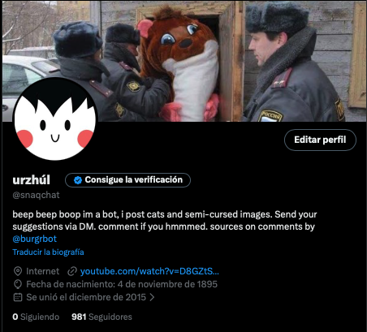
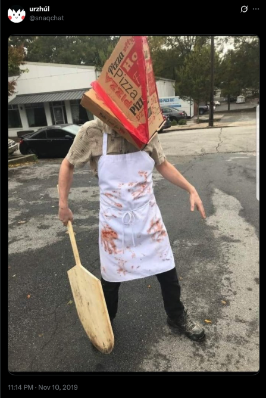
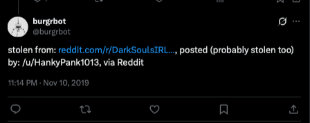
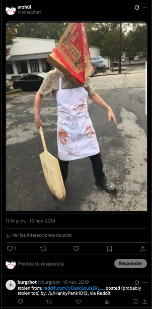

# Urzhúl Bot

Urzhúl is an automated Twitter bot that curates and publishes visual content sourced from Reddit, including `memes`, `cats`, and `cursed images`.

The bot operates autonomously, fetching media via the `Reddit API`, storing images metadata in `Firebase`, and publishing posts to Twitter at fixed intervals using the `Twitter API` and `Node.js`.

### Urzhúl Twitter Profile

---

## Overview

Urzhúl was built as an experiment in:

- API-to-API automation  
- Scheduled content publishing  
- Cross-platform media handling  
- Basic persistence and deduplication  

Rather than manual curation, the bot functions as a pipeline:

**Reddit → Firebase → Twitter**

### Urzhúl Post Example

---

## How It Works

- Periodically queries previously liked Reddit posts (from a specific user).
- Stores image URLs and metadata in `Firebase` to:
  - track already posted memes
  - prevent reposting the same content
  - allow reposts only when the same meme originates from a different source
- Publishes media content to Twitter automatically.
- Posts every **two hours** without manual intervention.

A companion bot, [burgrbot](https://github.com/supa-haxor/burgrbot), publishes attribution information for each post.

---

## Attribution & Credit

To promote minimal source transparency, [burgrbot](https://github.com/supa-haxor/burgrbot) replies to Urzhúl’s tweets with:

- a link to the original Reddit post  
- the Reddit username of the submitter  

This does not guarantee original authorship, but it:

- provides traceability  
- credits the platform of origin  
- promotes basic decency in automated reposting  

### Burgrbot Context Reply Example

---

## Bot Commands & Interaction

The **burgrbot** companion bot is not just for attribution — it can accept **commands from authorized Twitter accounts** to manage Urzhúl’s content.  

### Supported Commands
- **Post a specific image**  
  Add a Firebase image ID to the command, and Urzhúl will post that image automatically.

- **Post a random image**  
  Commands can trigger a random media post from the Firebase database.

### Access Control
- Only valid Twitter usernames (pre-approved) can trigger these commands.
- Unauthorized users are ignored. Invalid commands receive a polite reply indicating the command was not recognized.

This feature allows controlled **manual overrides and testing** without giving anyone unrestricted access to the bot.

### Burgrbot Reply when asking to post manually a specific post

### Burgrbot Reply when asking to post manually no specifying a specific post

---

## Tech Stack

- **JavaScript (Node.js)**
- **Twitter API**
- **Reddit API**
- **Firebase** (content tracking and deduplication)
- **Heroku** (deployment)

---

## Deployment Notes

Urzhúl was deployed on Heroku and executed as a scheduled background process.

Local execution requires:

- Twitter API credentials  
- Reddit API credentials  
- Firebase configuration  
- Environment variables properly set  

---

## Example Output

- Example Urzhúl tweet (media post): 
<blockquote class="twitter-tweet">
<a href="https://t.co/7Y37abskHS">pic.twitter.com/7Y37abskHS</a>
&mdash; urzhúl (@snaqchat) <a href="https://twitter.com/snaqchat/status/1193743783264968705?ref_src=twsrc%5Etfw">November 11, 2019</a></blockquote>

- Example attribution reply by burgrbot: 
<blockquote class="twitter-tweet">
stolen from: <a href="https://t.co/XM9DhfD5gN">https://t.co/XM9DhfD5gN</a>, posted (probably stolen too) by: /u/HankyPank1013, via Reddit
&mdash; burgrbot (@burgrbot) <a href="https://twitter.com/burgrbot/status/1193743784829476865?ref_src=twsrc%5Etfw">November 11, 2019</a></blockquote>

### Combined View of post and reply

---

## Project Status

- No longer actively maintained
- Preserved as a working example of:
  - social media automation
  - scheduled bots
  - API orchestration
  - Firebase-backed deduplication and state tracking

